# expo-react-native-boilerplate

A multi-tenant mobile client for iOS, Android and web, built on Expo SDK 57 and React Native 0.86. It is the mobile counterpart of [next-boilerplate](https://github.com/kuraykaraaslan/next-boilerplate): it signs in against that server's device-bearer auth, works inside one organization (tenant) at a time, and uses the same design language through [kui-native](https://github.com/kuraykaraaslan/kui-native).

> **AI agents:** start with [AGENTS.md](AGENTS.md). The machine-readable catalog lives in [public/registry/](public/registry/) and an MCP server is configured in [.mcp.json](.mcp.json).

## Screenshots

Captured from the web build against a mock API. Most shots use the Turkish locale; members, invitations and notifications are in English.

**Sign-in and organizations**

<p align="center">
  
  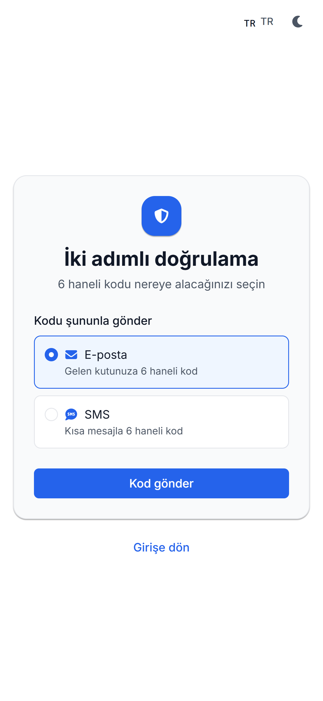
  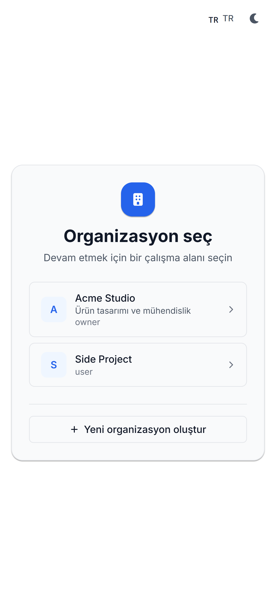
  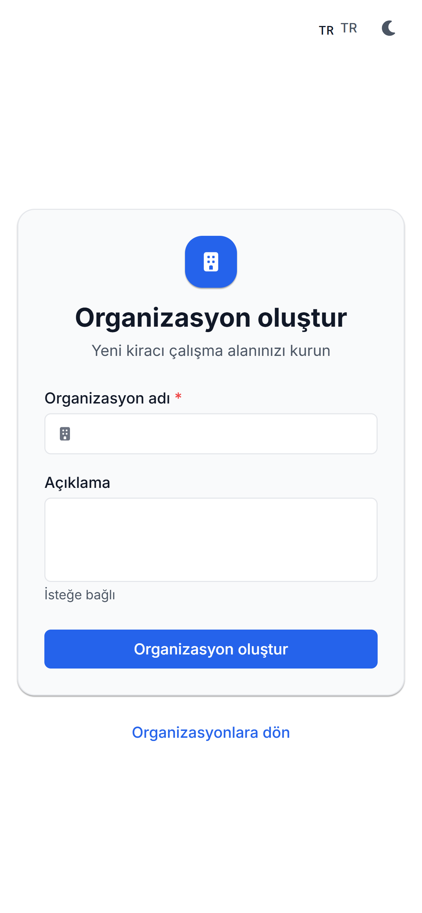
</p>

**Workspace**

<p align="center">
  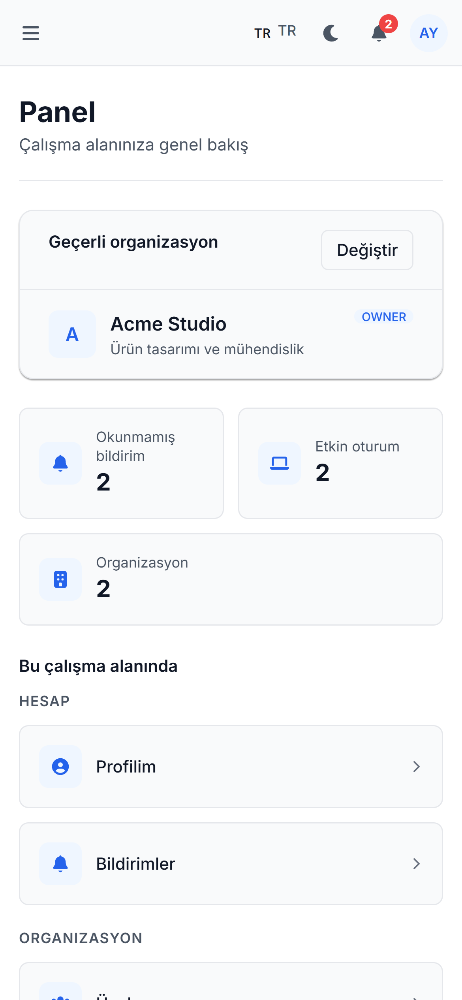
  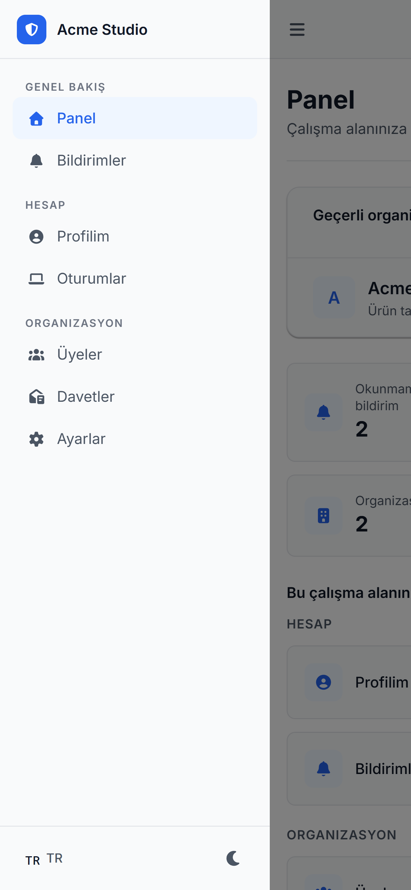
  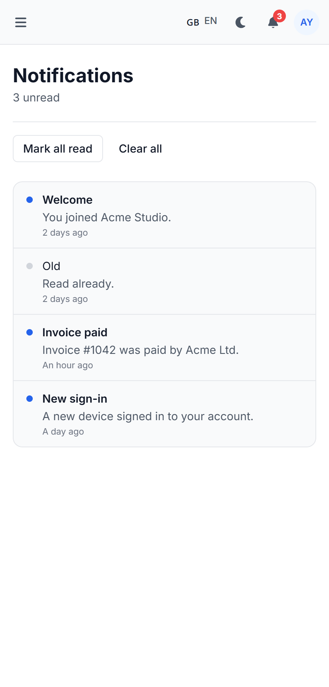
</p>

<p align="center">
  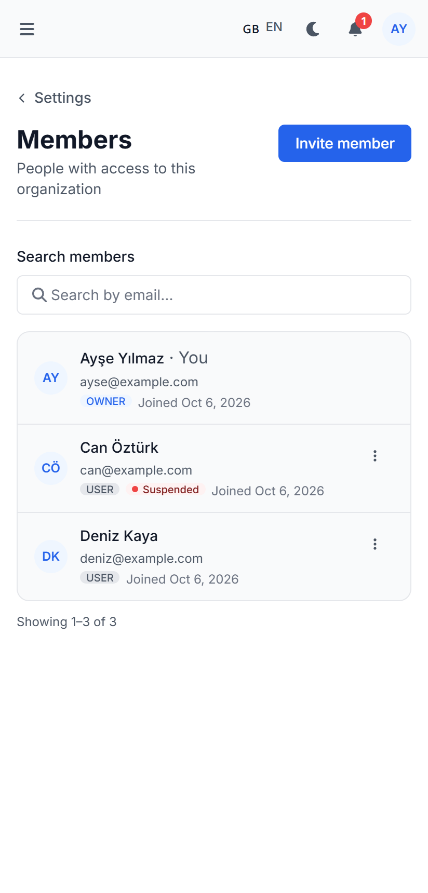
  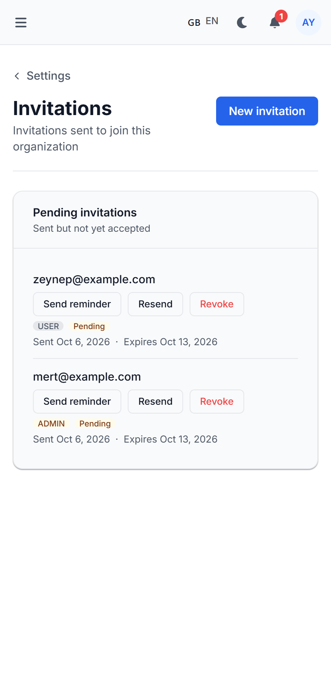
</p>

**Dark mode**

<p align="center">
  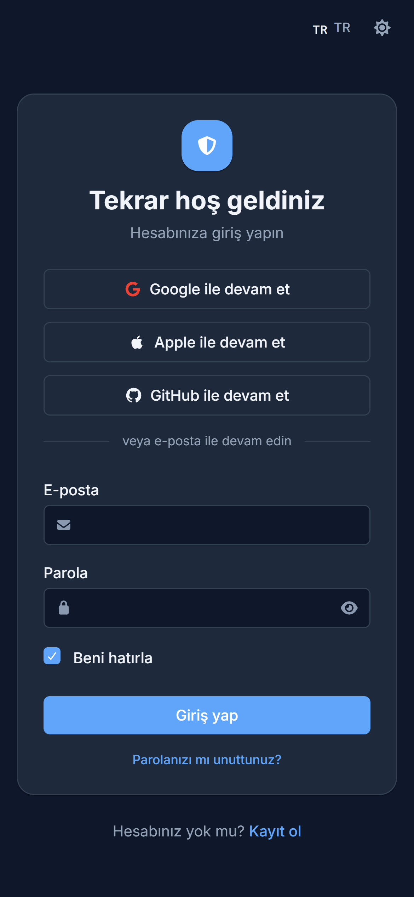
  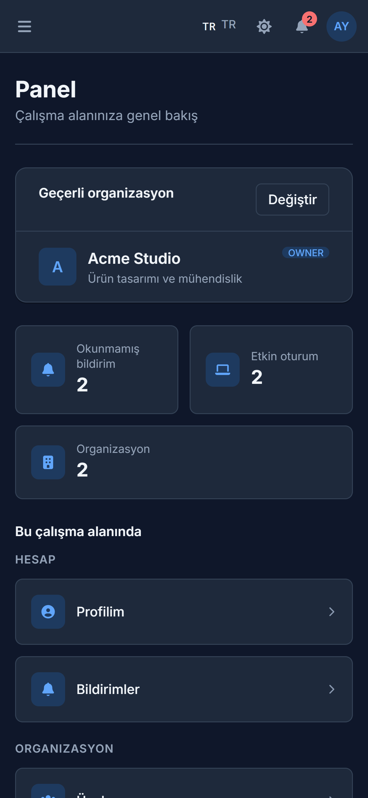
  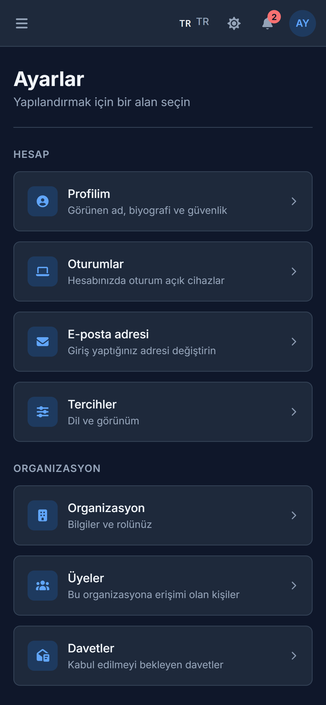
  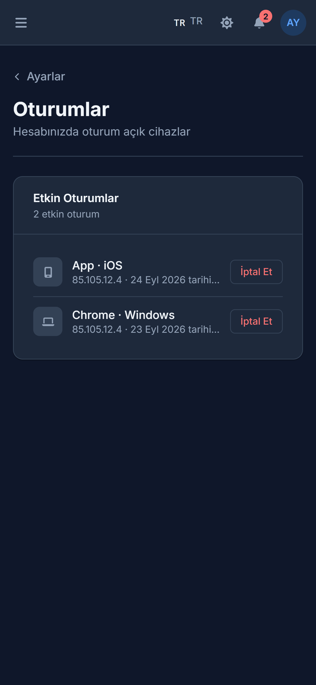
</p>

## What's included

**Authentication**
- Email and password sign-in, registration, forgot and reset password, forced password change.
- Two-factor verification by one-time code.
- SSO buttons for whichever providers the tenant enables (Google, Apple, GitHub and others). The client side is done; it needs a server change in next-boilerplate that is written but not yet verified on a device.
- Device bearer tokens kept in `expo-secure-store`, one access/refresh pair per tenant, refreshed automatically by the axios interceptor.

**Organizations (tenants)**
- Pick an organization, create a new one, or switch between them. Switching to one you have already signed in to does not ask for the password again.
- Members: server-side paging and search, edit role, suspend and reactivate.
- Invitations: send, resend, remind and revoke.

**Account**
- Profile, active sessions with per-device revoke, linked social accounts.
- Language and theme preferences, synced with the server.

**Notifications**
- In-app inbox with an unread badge in the header, polled while the app is in the foreground. Mark one or all as read; tapping a notification opens its target.

**App shell**
- Drawer navigation, header with language switcher, theme toggle, notification bell and user menu.
- Light and dark themes.
- Six languages: English, Turkish, German, French, Spanish, Italian.

## Stack

| Area | Choice |
|---|---|
| Framework | Expo SDK 57, React Native 0.86, React 19, TypeScript (strict) |
| Routing | Expo Router, file-based, with `(auth)`, `(tenant)` and `(drawer)` groups |
| UI | kui-native components, re-exported from `@/components/ui` |
| Styling | NativeWind (Tailwind CSS) with semantic tokens |
| State | Zustand 5, persisted to MMKV |
| Secrets | `expo-secure-store` (tokens never go into Zustand) |
| Networking | One shared axios instance in `libs/axios.ts` |
| Validation | Zod for DTOs and environment variables |
| i18n | i18next and react-i18next |
| Icons | FontAwesome 7 |
| Feedback | `sonner-native` toasts, `expo-haptics` |
| Tests | Jest, `jest-expo`, React Native Testing Library, MSW |

## Getting started

### Prerequisites

- Node.js LTS and npm
- A running [next-boilerplate](https://github.com/kuraykaraaslan/next-boilerplate) server, and the UUID of a tenant on it
- For devices: Expo Go, or an Android emulator / iOS simulator

### Install and run

```sh
git clone https://github.com/kuraykaraaslan/expo-react-native-boilerplate.git
cd expo-react-native-boilerplate
npm install
cp .env.example .env    # then fill in the values below
npm start
```

Press `a` for Android, `i` for iOS or `w` for web in the Expo CLI, or scan the QR code with Expo Go.

### Environment

All variables are validated with Zod in [libs/env.ts](libs/env.ts); the app fails fast if one is wrong.

| Variable | Required | Notes |
|---|---|---|
| `EXPO_PUBLIC_API_URL` | no | Server origin only, without `/api`. Defaults to `http://10.0.2.2:3000` (Android emulator to host). Use `http://localhost:3000` on the iOS simulator and web. |
| `EXPO_PUBLIC_DEFAULT_TENANT_ID` | yes | Tenant UUID a fresh install signs in to. The server has no public tenant lookup, so the app needs a starting point. |
| `EXPO_PUBLIC_APP_NAME` | no | Display name. |
| `EXPO_PUBLIC_APP_VERSION` | no | Sent with the device info on sign-in and used by `app.config.ts`. |
| `EXPO_PUBLIC_FRONTEND_URL` | no | Web frontend URL, used to resolve notification links that point at the website. |
| `EAS_PROJECT_ID` | no | Only for EAS builds. |

Every request goes to `<API_URL>/api/tenant/<activeTenantId>/<path>`; the interceptor adds the tenant prefix and the bearer token.

## Scripts

| Command | What it does |
|---|---|
| `npm start` | Start the Expo dev server |
| `npm run android` / `ios` / `web` | Start and open on that platform |
| `npm run typecheck` | `tsc --noEmit` |
| `npm run lint` | `expo lint` |
| `npm test` | Jest in watch mode |
| `npm run test:ci` | Jest once, for CI |
| `npm run build` | `expo export` (rebuilds the AI catalog first) |
| `npm run registry:snapshot` | Rebuild the AI catalog in `public/` |
| `npm run mcp:server` | Start the project's MCP server over stdio |

## Project structure

```
app/                Expo Router screens
  (auth)/           login, register, 2fa, forgot/reset/change password
  (tenant)/         select, create and sign in to an organization
  (drawer)/         dashboard, notifications, settings/ (profile, sessions, tenant/members, ...)
components/
  ui/index.ts       kui-native re-exports, the only place app code gets UI primitives from
  common/           Screen, ScreenHeader, LinkTile, StatTile, ConfirmDialog, ...
  shell/            AppHeader, DrawerContent, UserMenu, ThemeToggle, LangSwitcher
  auth/ account/ tenant/
services/<domain>/  <domain>.service.client.ts + <domain>.dto.ts (auth, tenant, user)
stores/             Zustand stores: auth, tenant, notification, sso, app
libs/               axios, env, i18n, logger, mmkv, secureStorage, theme, ...
utils/              cn() and small pure helpers
locales/            en, tr, de, fr, es, it
__tests__/          Jest tests with an MSW mock server
phases/             phase-by-phase plan and records
public/             AI catalog (registry JSON, per-component markdown, llms.txt)
```

The full rulebook (path alias, storage, logging, icon and styling rules) is in [AGENTS.md](AGENTS.md).

## UI kit: kui-native

UI primitives come from [kui-native](https://github.com/kuraykaraaslan/kui-native), installed from GitHub and pinned to a tag:

```json
"kui-native": "git+https://github.com/kuraykaraaslan/kui-native.git#v0.3.1"
```

- Import components from `@/components/ui` only. That file deep-imports each component, so kui-native's optional peers (maps, video) never get pulled in. To use another component, add a line there.
- The palette matches next-boilerplate. Brand overrides go in [libs/theme/brand.ts](libs/theme/brand.ts); raw token colors for props that don't take `className` come from `useThemeTokens()` in `@/libs/theme/ThemeContext`.
- Never edit `node_modules/kui-native` or copy its source here. Fix the bug in kui-native and release a new tag.

To upgrade:

1. Tag a release in kui-native (`vX.Y.Z`) and push the tag.
2. Change the `#vX.Y.Z` suffix in `package.json` and run `npm install`.
3. Run `npm run typecheck && npm run test:ci`.
4. Commit it on its own: `chore(deps): kui-native vX.Y.Z`.

Always pin a tag, never a branch.

## Roadmap

Work is organized into phases; [phases/README.md](phases/README.md) has the full plan, decisions and status.

- [x] Build fix, Expo SDK 57, kui-native as a dependency, visual parity with next-boilerplate
- [x] Device-bearer transport, DTOs and services aligned with the server
- [x] Auth screens and tenancy core
- [x] In-app notifications and unread badge
- [ ] SSO: client done, waiting on server verification
- [ ] Members and invitations: done except accepting and declining an invitation
- [ ] Push notifications (needs a server change)
- [ ] Security screen, TOTP and biometric lock; passkeys
- [ ] Account audit, tenant settings and branding
- [ ] Consent, privacy requests and account deletion
- [ ] Server-driven locale and feature flags, file uploads, realtime messaging, search, API keys and domains

## For AI agents

- [AGENTS.md](AGENTS.md) is the orientation guide and the source of the hard rules.
- [public/registry/](public/registry/) holds the catalog of screens, components, services, stores, DTOs and libs. Run `npm run registry:snapshot` after adding, renaming or removing any of them, and commit the result.
- The MCP server in [.mcp.json](.mcp.json) exposes the same catalog (`list_screens`, `get_component`, `get_conventions`, ...).
- Editor rule mirrors: [.cursor/rules/expo-react-native.mdc](.cursor/rules/expo-react-native.mdc), [.cursorrules](.cursorrules), [.windsurfrules](.windsurfrules), [.github/copilot-instructions.md](.github/copilot-instructions.md), [.clinerules](.clinerules).

## Contributing

1. Fork the repository and create a branch (`git checkout -b feat/my-change`).
2. Follow the rules in [AGENTS.md](AGENTS.md); run `npm run typecheck`, `npm run lint` and `npm run test:ci`.
3. Use Conventional Commits (`feat(scope): ...`, `fix(scope): ...`).
4. Open a pull request.
